# AWS Lab 1 - Networking

## Cloud Engineering Snapshot
This lab demonstrates practical AWS networking fundamentals using **awscli** on a local AWS testing environment (*LocalStack*), particularly in:
```
- VPC design, subnets, Internet Gateways, and route table configuration.
- Local cloud simulation with LocalStack
- Infrastructure validation from the terminal
- Resource discovery using CLI filters and queries
- Understanding of public routing design and CIDR planning
```

At a glance:
- Built a VPC with a private IP Range.
- Created a public subnet inside that VPC.
- Provisioned and attached an Internet Gateway.
- Inspected and updated route tables to enable outbound internet routing.
- Verified the environment using AWS CLI and LocalStack health endpoints.
- Demonstrated command-line fluency with `aws`, `awslocal`, `curl`, `jq`, `docker-compose`, and resource-tagging best practices.


## Environment Setup
The lab began by preparing the local AWS tooling and the LocalStack container environment.

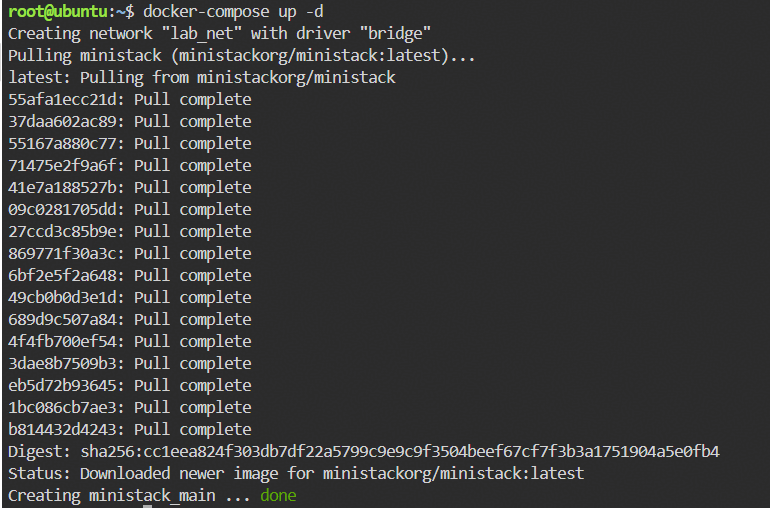

The environment was brought up with Docker Compose, then the AWS CLI installation and version check were verified locally.

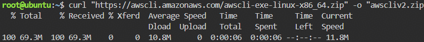

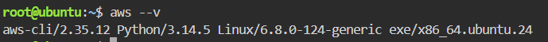

The LocalStack health endpoint was then checked to confirm the emulated services were ready for use.

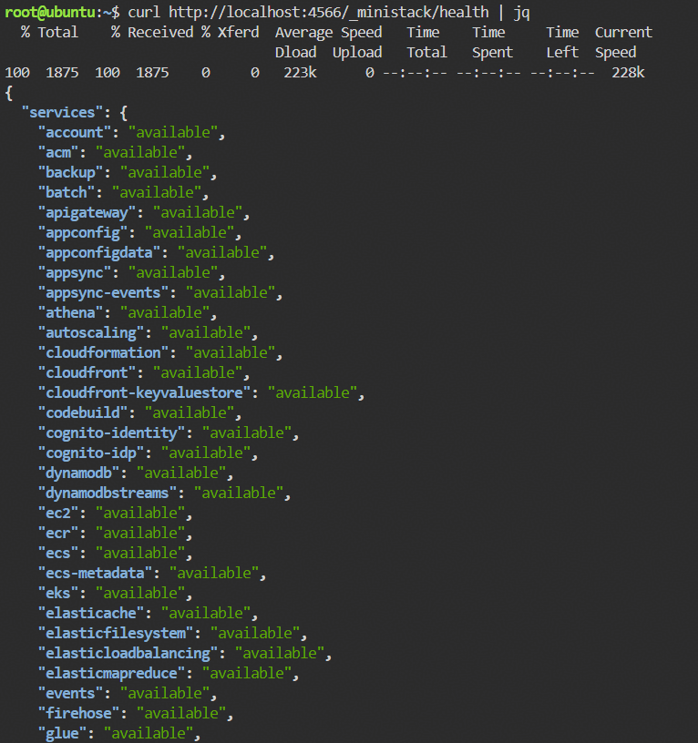

As a quick service-level validation, a test S3 bucket was created against the local AWS endpoint.

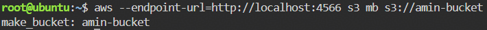

- `aws --endpoint-url=...` was used to send requests to a local service endpoint instead of AWS itself.
- `awslocal` simplified CLI access to LocalStack-managed services.
- The health endpoint confirmed the available services before provisioning resources.

## Networking Build Flow

### 1. Create the VPC
A VPC was created with the CIDR block `10.0.0.0/16` and tagged as `LabVPC`.

```bash
awslocal ec2 create-vpc --cidr-block 10.0.0.0/16 \
  --tag-specifications 'ResourceType=vpc,Tags=[{Key=Name,Value=LabVPC}]'
```

Key takeaways:
- A VPC is the isolated network boundary for AWS resources.
- The CIDR block defines the address space available for subnets and workloads.
- Tagging makes resources easier to identify and manage.

### 2. Resolve the VPC ID
The VPC ID was queried from the created resource so it could be reused in later commands.

```bash
VPC_ID=$(awslocal ec2 describe-vpcs \
  --filters "Name=tag:Name,Values=LabVPC" \
  --query "Vpcs[0].VpcId" --output text)

echo "VPC_ID=$VPC_ID"
```

Key takeaways:
- This shows CLI-driven automation instead of manually copying IDs.
- It is a practical workflow for scripting AWS infrastructure tasks.

### 3. Create the Subnet
A public subnet was created inside the VPC using the smaller CIDR block `10.0.1.0/24`.

```bash
awslocal ec2 create-subnet --vpc-id $VPC_ID --cidr-block 10.0.1.0/24 \
  --tag-specifications 'ResourceType=subnet,Tags=[{Key=Name,Value=PublicSubnet}]'
```

Key takeaways:
- Subnets partition the VPC address space into smaller network segments.
- A `/24` subnet leaves room for instances while maintaining clear segmentation.
- Naming the subnet as `PublicSubnet` reflects its intended routing model.

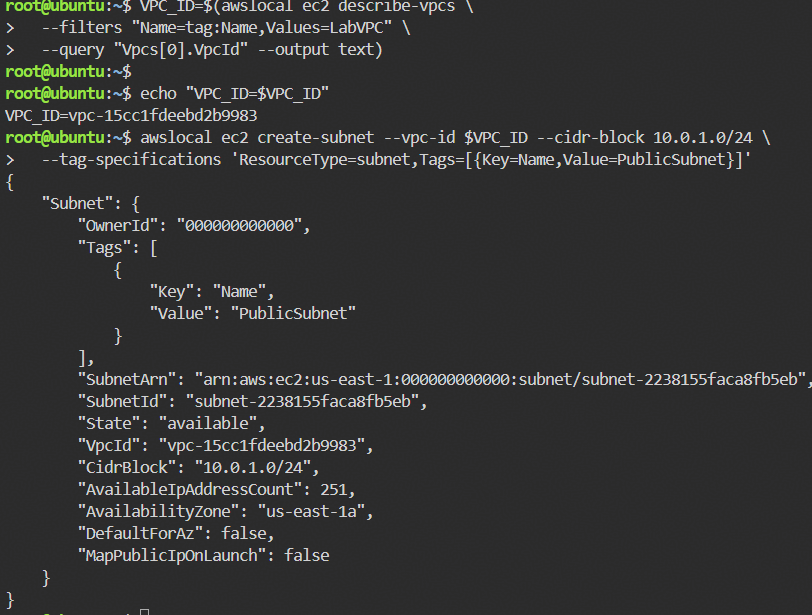

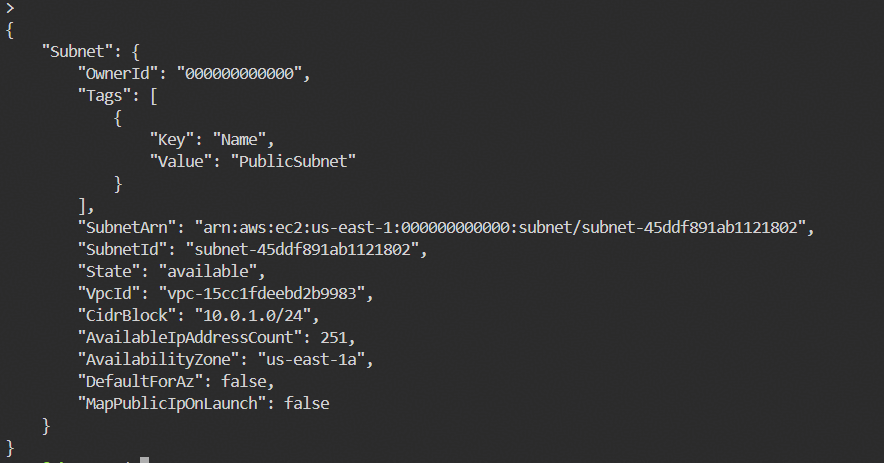

### 4. Create the Internet Gateway
An Internet Gateway was created as the component that enables internet-bound traffic for resources in the VPC.

```bash
awslocal ec2 create-internet-gateway
```

Key takeaways:
- An IGW is the AWS-managed entry and exit point to the public internet.
- On its own, it is detached and not yet active for the VPC until attached.

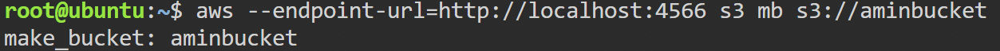

### 5. Attach the Internet Gateway
The IGW was attached to the VPC.

```bash
awslocal ec2 attach-internet-gateway --internet-gateway-id <your-igw-id> --vpc-id <your-vpc-id>
```

Key takeaways:
- Attaching the gateway is required before it can be used in routing.
- This is the transition from isolated VPC networking to internet-enabled routing.

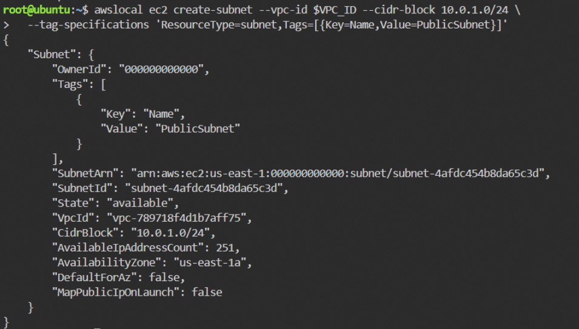

### 6. Inspect Internet Gateway State
The Internet Gateway was described to confirm its attachment status.

```bash
awslocal ec2 describe-internet-gateways
```

Key takeaways:
- The IGW existed successfully.
- Its attachment state reflected the VPC association.

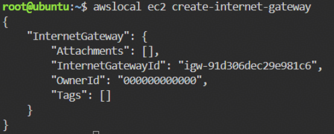

### 7. Inspect Route Tables
The route tables were listed and inspected before the default route was added.

```bash
awslocal ec2 describe-route-tables
awslocal ec2 describe-route-tables --filters "Name=vpc-id,Values=vpc-789718f4d1b7aff75" --query "RouteTables[*].RouteTableId" --output text
```

Key takeaways:
- Route tables define where network traffic is sent.
- The main route table already contained the local VPC route for `10.0.0.0/16`.
- The lab required identifying the correct route table before modifying it.

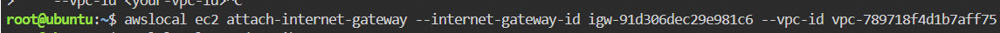

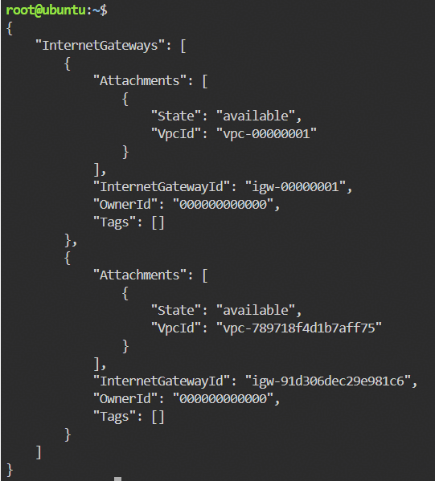

### 8. Add the Default Route to the IGW
A route was created for `0.0.0.0/0` pointing to the Internet Gateway.

```bash
awslocal ec2 create-route --route-table-id <your-route-table-id> --destination-cidr-block 0.0.0.0/0 --gateway-id <your-igw-id>
```

Key takeaways:
- `0.0.0.0/0` is the default route for all destinations outside the VPC.
- Associating it with the IGW enables outbound internet access for public subnets.
- This is the core step that turns a subnet into a public subnet pattern.

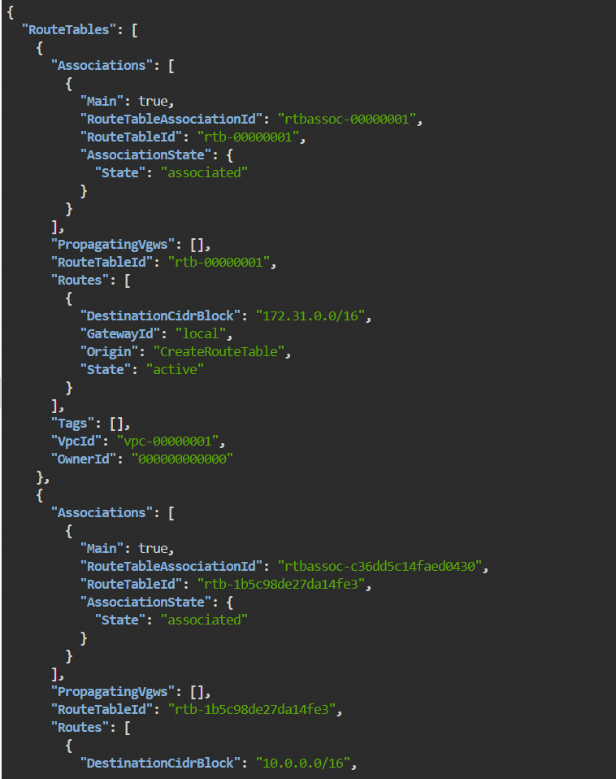

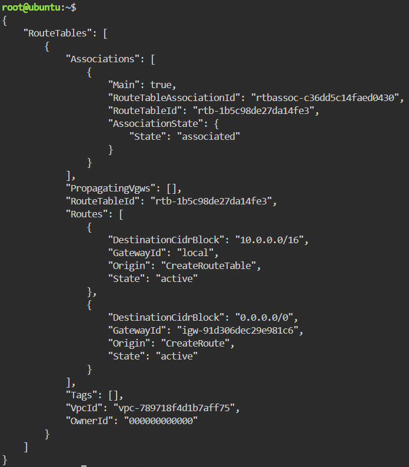

### 9. Verify the Final Routing
The final route table output confirmed both the local route and the default internet route.

Final state:
- `10.0.0.0/16 -> local`
- `0.0.0.0/0 -> igw-...`

## Concepts
- VPC: logically isolated AWS network boundary
- CIDR planning: address allocation for the VPC and subnet
- Subnet: smaller address range inside a VPC
- Internet Gateway: enables internet access for VPC traffic
- Route table: determines path selection for network traffic
- Default route: `0.0.0.0/0` for all non-local destinations
- Tagging: operational naming for manageability
- LocalStack: local AWS-compatible emulation for safe practice and validation

## Closing Note
This exercise reflects practical cloud networking work: preparing tooling, provisioning network primitives, and validating route behavior through the CLI. It is a solid foundation for more advanced topics such as NAT, security groups, multi-tier VPC design, and private/public subnet separation.
